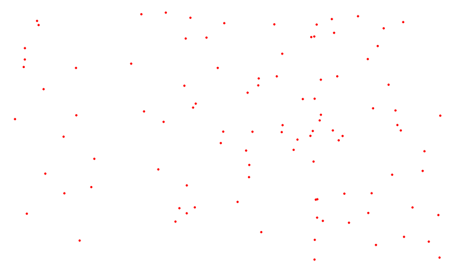
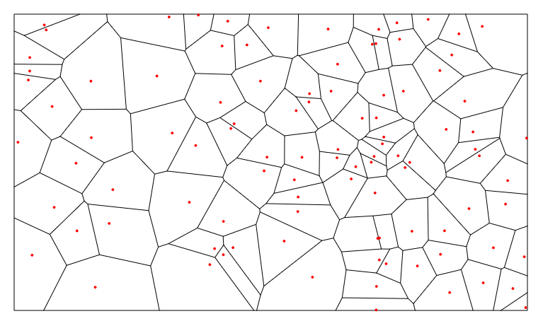
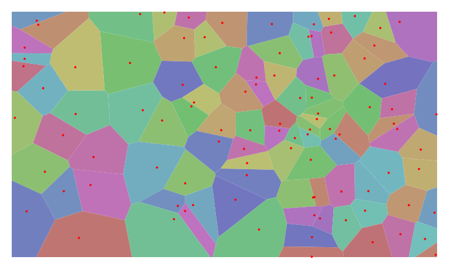

Have you ever hade a bunch of points just sitting on a plane and wondered "Given some arbirary location on this plane, what is the closest point?" I have. And a Voronoi diagram will show you the answer. Let's create one.

There are a few efficient algorithms to calculate Voronoi diagrams. Those would definitly be interesting too look at, but for now we'll just use a javascript library that's ready to go. Once we've computed the diagram we'll look at a few ways to visualize it's output with [paper.js](http://paperjs.org/).

# Setup

First install the library.

`npm install voronoi`

Now include an initialize it on the page.

```javascript
import Voronoi from 'voronoi';

const voronoi = new Voronoi();
```

Now we need some points. Here they are just being placed at random, but other point placing stragies could be used. Or you could even use real-world data for your points.

```javascript
function randomPoints([width, height], nPoints, margin = 0) {
  const points = [];
  for (let i = 0; i < nPoints; i++) {
    points.push({ 
      x: random(margin, width - margin), 
      y: random(margin, height - margin) 
    });
  }
  return points;
}

const margin = 20;
const width = 1000;
const height = 1000;
const nPoints = 100;
const points = randomPoints([width, height], nPoints, margin);
```

`points` is an array containing 100 objects with `x` and `y` properties bound by the width and height plus the margin of 20 we gave.



# Computing the diagram

To compute the Voronoi diagram we need one last thing, a bounding box. Without a bounding box the outside partitions of the plane would shoot off to infinity, and infinity is hard to draw, The `voronoi` library won't compute the diagram without one. The bounding box is an object with `xl`, `xr`, `yt`, and `yb` properties, for 'left', 'right', 'top', and 'bottom'. Now just call the compute method.

```javascript
const bbox = { xl: margin, xr: width - margin, yt: margin, yb: height - margin };

const diagram = voronoi.compute(points, bbox);
```

The compute method returns an object describing the voronoi diagram. It is still up to us to draw it. The object describes the voronoi diagram as a collection of `cells`, `edges`, and `vertices`. With these properties we can draw the diagram a number of ways.

# Drawing the edges

The most simple way to draw the diagram is to just iterate through the edges list. We can iterate through the list of edges and draw them. This will show the boundaries of all the cells. The edges are not listed in any particular order, but it does have `lSite` and `rSite` The edge properties which refer to the points on the left and right of the edge. `va` and `vb` are the vertices of the edge. They are what we need to draw the line between.

```javascript
diagram.edges.forEach(edge => {
  new Path.Line({
    from: edge.va,
    to: edge.vb,
    strokeColor: 'black'
  });
});
```



# Drawing Cells

Another way to draw the diagram is by iterating over the cells. Each cell has an array of `halfedges`. A `halfedge` is slightly different from the edge we just drew because it is specific to a cell and it is directed. The halfedges alway run in a counter-clockwise direction around the point the cell contains. We can use the halfedge's `getEndpoint` method to get all the points to form a path. Here the path is filled with a random color.

```javascript
diagram.cells.forEach(cell => {
  if (cell && cell.halfedges.length > 2) {
    const segments = cell.halfedges.map(edge => edge.getEndpoint());
    const path = new Path({
      segments,
      closed: true,
      fillColor: please.make_color()
    });
  }
});
```



# Another way to get the voronoi cells.

We might want to know which cell belong to a specific point we created. To help out with that the voronoi library has mutated the points array we passed to the `compute` call. It has added a `voronoiId` property on each of the point objects. This property is a number that indexes into the cells array.

```javascript
const cell = diagram.cells[points.voronoiId];
```